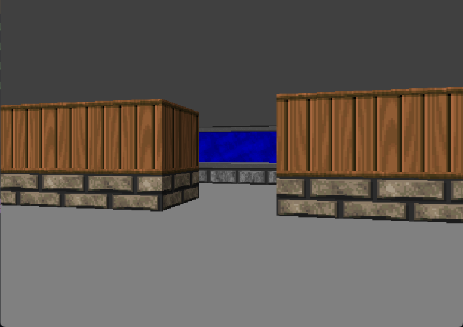

# 🧭 Java Raycaster Engine

A simple **3D raycasting engine** written in Java, inspired by the rendering techniques used in early 90s games like **Wolfenstein 3D** and **DOOM**. This project renders a 3D environment using a raycasting algorithm.

---

## 🚀 Features

- Real-time first-person 3D view
- Keyboard controls using `W`, `A`, `S`, `D`
- Smooth movement and rotation
- Configurable map and camera
- Pure Java (no external libraries)

---

## 🎮 Controls

| Key | Action          |
|-----|-----------------|
| `W` | Move Forward    |
| `S` | Move Backward   |
| `A` | Rotate Left     |
| `D` | Rotate Right    |

---

## 📁 Project Structure

```

RaycasterProject/
├── Game.java          # Main class which renders the game
├── Texture.java       # Main class for texturing
├── Camera.java        # Main class which handles camera movement
├── Screen.java        # Main class for handling screen display
└── assets             # Holds the textures

```

---

## 🛠️ How to Run

1. **Clone or Download** the repository.

2. **Compile the Java files**:
```
  javac Game.java
```

3. **Run the main class**:
   ```
   java Game
   ```

4. Use your keyboard to explore.

---

## 📷 Screenshots

Here's a preview of how the map may look like:



---

## 🧠 How It Works

* Rays are cast from the camera’s point of view to detect wall collisions on a 2D map.
* For each vertical screen column, the distance to the nearest wall hit is calculated.
* This distance is then used to draw vertical slices representing wall height, simulating depth.
* Movement and rotation are handled by the `Camera` class, using `WASD` keys.

---

## 📚 References

Here are the references used for this project:

- [Making a Basic 3D Engine](https://www.instructables.com/Making-a-Basic-3D-Engine-in-Java/) - For the process with the codes
- [Wikipedia – Ray casting](https://en.wikipedia.org/wiki/Ray_casting) - General overview of ray casting as a rendering technique.
- [Java AWT KeyEvent Documentation](https://docs.oracle.com/javase/8/docs/api/java/awt/event/KeyEvent.html) - Official documentation for keyboard input handling in Java.
- [Stack Overflow – Basic Java Game Loop](https://stackoverflow.com/questions/31039816/how-to-create-a-basic-game-loop-in-java) - Useful discussion on how to structure a simple game loop in Java for real-time rendering.

---

👨‍💻 **Developed by** - @Arijit2175
